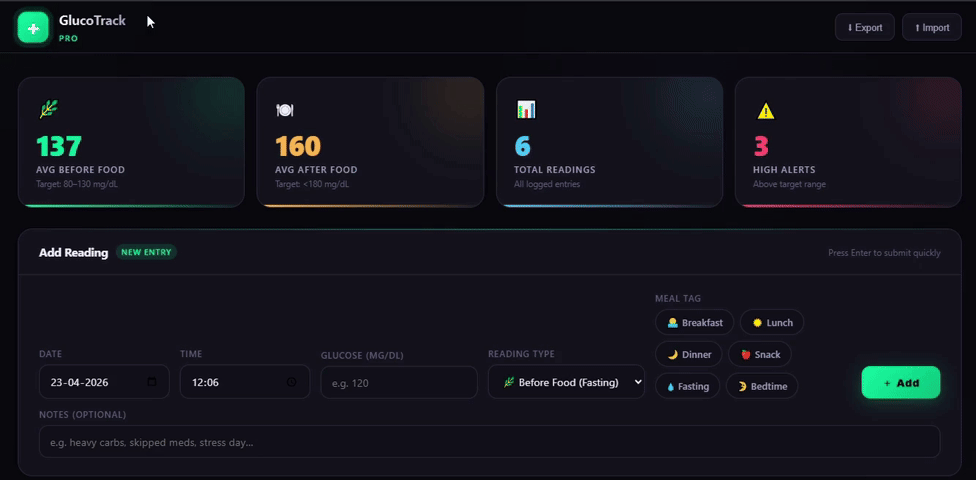

# ✚ GlucoTrack Pro

> **Track your glucose. Keep your data. No cloud. No account.**


---

## 💭 Why I Built This

Most glucose tracking apps either:

* require accounts
* store sensitive health data in the cloud
* or feel unnecessarily complicated

I wanted something simpler.

So I built **GlucoTrack Pro** — a fast, clean, **fully offline web app** that keeps everything on your device and still gives you meaningful insights.

No sync. No login. No noise.

---

## ✨ What It Feels Like

### 📝 Track in Seconds

* Log readings with date, time, and context
* Tag meals (breakfast, lunch, dinner, etc.)
* Add notes when something feels off

---

### 📈 See the Patterns

* Before vs After food trends
* Interactive zoom & pan
* Clean, readable charts

---

### 🧠 Understand Your Data

* Average glucose insights
* High reading alerts
* Meal-based analysis

---

## 🎬 Demo



---

## ⚡ Highlights

* ⚡ Runs entirely in your browser
* 🔒 100% local data (localStorage)
* 📱 Installable as a PWA
* 🌙 Beautiful dark UI with glassmorphism
* 📊 Interactive charts with zoom/pan
* 📁 Export & restore your data anytime

---

## 📊 Insights That Actually Help

Instead of just logging numbers, GlucoTrack Pro helps you:

* Spot **before vs after meal spikes**
* Compare **meal impact on glucose**
* Track **long-term trends visually**
* Identify **high-risk readings instantly**

---

## 🚀 Getting Started

### Option 1 — Just Open It

```bash
open index.html
```

That’s it.

---

### Option 2 — Run with a Local Server (for PWA)

```bash
# Python
python -m http.server

# Node.js
npx serve
```

Then visit:

```
http://localhost:8000
```

---

## 🔐 Your Data Stays Yours

* No servers
* No APIs
* No tracking
* No login

Everything is stored in your browser using:

```js
localStorage["glucotrack_v2"]
```

You can export or delete it anytime.

---

## 🔄 Backup & Restore

### Export

* Downloads a `.txt` file
* Includes full JSON backup

### Import

* Upload the file
* Instantly restores all readings

---

## 🧪 Example Data Format

```json
{
  "date": "2026-04-23",
  "time": "08:30",
  "glucose": 110,
  "type": "before",
  "meal": "breakfast",
  "notes": "Felt normal"
}
```

---

## 🧩 Tech Stack

* Vanilla HTML, CSS, JavaScript
* Chart.js (v4.4.0)
* chartjs-plugin-zoom
* Hammer.js
* Service Workers + Web Manifest

---

## 🧰 Project Structure

```
glucotrack-pro/
│
├── index.html
├── tour_script.js
├── tour_styling.js
└── README.md
```

---

<details>
<summary>🔧 Technical Details (for developers)</summary>

### Storage

* Key: `glucotrack_v2`
* Format: JSON array

### Charts

* Two line charts:

  * Before food
  * After food
* One bar chart:

  * Avg glucose by meal

### Filtering

* Date range
* Reading type
* Meal tag

### PWA

* Offline caching via service worker
* Install prompt enabled

</details>

---

## 🌱 Roadmap

* ⏳ Weekly / monthly summaries
* 🧮 HbA1c estimation
* 📤 CSV export
* 🔔 Custom alert thresholds
* 👥 Multi-profile (still local-first)

---

## ⚠️ Disclaimer

This app is for **personal tracking only**.
It is **not a medical device** and should not replace professional medical advice.

---

## 🙌 Contributing

Got ideas or improvements?
Feel free to fork, experiment, and open a PR.

---

## ⭐ If You Like This

* Give it a star — or better, use it daily.


